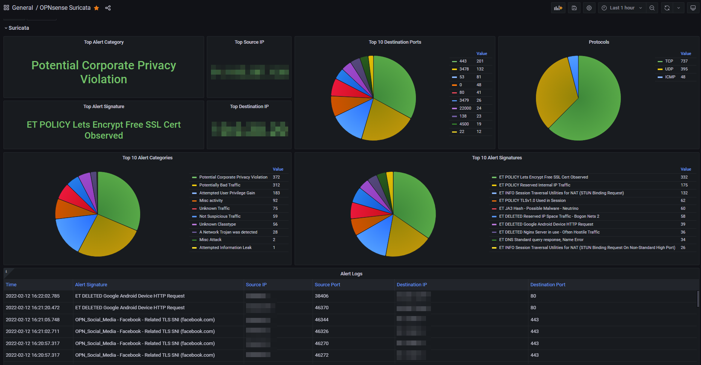

# What's Monitored
- Active Users
- Uptime
- CPU Load total
- Disk Utilization
- Memory Utilization
- CPU Utilization per core (Single Graph)
- Ram Utilization time graph
- Load Average
- Load Average Graph
- CPU and ACPI Temperature Sensors
- Gateway Response time - dpinger
- List of interfaces with IPv4, IPv6, Subnet, MAC, Status and pfSense labels thanks to [/u/trumee](https://www.reddit.com/r/PFSENSE/comments/fsss8r/additional_grafana_dashboard/fmal0t6/)
- WAN Statistics - Traffic & Throughput (Identified by dashboard variable)
- LAN Statistics - Traffic & Throughput (Identified by dashboard variable)
- Firewall Statistics - Blocked Ports, Protocols, Events, Blocked IP Locations, and Top Blocked IP
# Changelog

Updated for later versions of Docker, ElasticSearch, Grafana, Greylog, InfluxDB, OPNsense, and Telegraf.

# Running on

    Grafana 9.2.10
    InfluxDB 2.6.1
    Graylog 5.0.2

# Configuration
Configuration instructions can be found [here](./configure.md).
