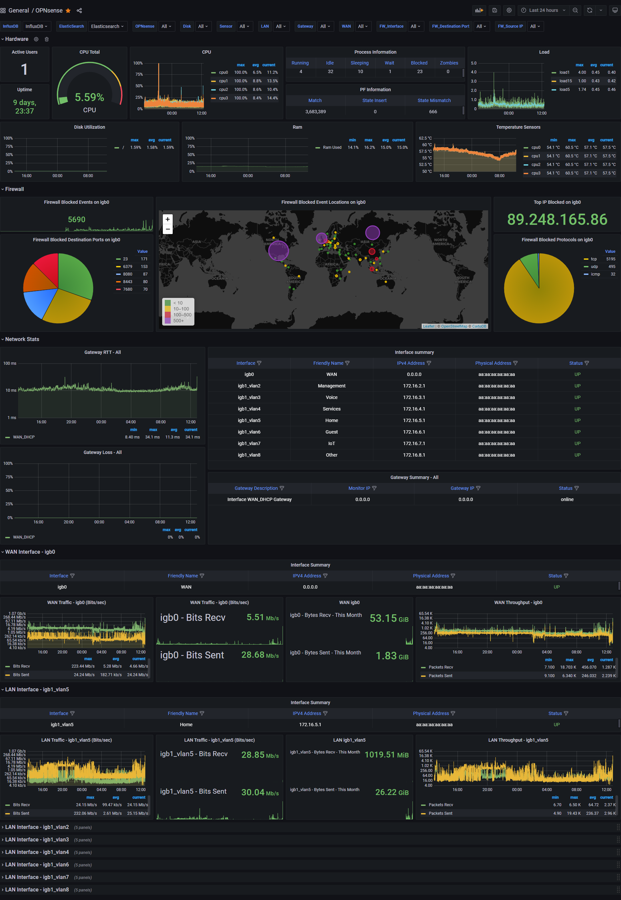

## What's Monitored
- Active Users
- Uptime
- CPU Load total
- Disk Utilization
- Memory Utilization
- CPU Utilization per core (Single Graph)
- Ram Utilization time graph
- Load Average
- Load Average Graph
- CPU and ACPI Temperature Sensors
- Gateway Response time - dpinger
- List of interfaces with IPv4, IPv6, Subnet, MAC, Status and pfSense labels thanks to [/u/trumee](https://www.reddit.com/r/PFSENSE/comments/fsss8r/additional_grafana_dashboard/fmal0t6/)
- WAN Statistics - Traffic & Throughput (Identified by dashboard variable)
- LAN Statistics - Traffic & Throughput (Identified by dashboard variable)
- Firewall Statistics - Blocked Ports, Protocols, Events, Blocked IP Locations, and Top Blocked IP

## Changelog


Converted InfluxQL queries to Flux.


Converted pFSense functions to OPNsense.


Added Firewall panels.



## Running on

    Grafana 8.2.4
    InfluxDB 2.1.1
    Graylog 4.2

### docker-compose example with persistent storage

```
version: '3'
services:
  mongodb:
    container_name: mongodb
    image: mongo:4.2
    volumes:
      - mongodb_data:/data/db
    restart: "unless-stopped"
  elasticsearch:
    container_name: elasticsearch
    image: docker.elastic.co/elasticsearch/elasticsearch-oss:7.10.2
    volumes:
      - es_data:/usr/share/elasticsearch/data
    environment:
      - http.host=0.0.0.0
      - transport.host=localhost
      - network.host=0.0.0.0
      - "ES_JAVA_OPTS=-Xms512m -Xmx512m"
    ulimits:
      memlock:
        soft: -1
        hard: -1
    mem_limit: 1g
    restart: "unless-stopped"
  graylog:
    container_name: graylog
    image: graylog/graylog:4.2
    volumes:
      - graylog_data:/usr/share/graylog/data
    environment:
      # CHANGE ME (must be at least 16 characters)!
      - GRAYLOG_PASSWORD_SECRET=ZDcwMzQ3NTE4ZTIwM
      # Username is "admin"
      # Password is "admin", change this to your own hashed password. 'echo -n "password" | sha256sum' 
      - GRAYLOG_ROOT_PASSWORD_SHA2=8c6976e5b5410415bde908bd4dee15dfb167a9c873fc4bb8a81f6f2ab448a918
      - GRAYLOG_HTTP_EXTERNAL_URI=http://127.0.0.1:9000/
      entrypoint: /usr/bin/tini -- wait-for-it elasticsearch:9200 --  /docker-entrypoint.sh
    links:
      - mongodb:mongo
      - elasticsearch
    depends_on:
      - mongodb
      - elasticsearch
    ports:
      # Graylog web interface and REST API
      - 9000:9000
      # Syslog UDP
      - 1514:1514/udp
      # Syslog TCP
      - 1514:1514
      # GELF TCP
      - 12201:12201
      # GELF UDP
      - 12201:12201/udp
    restart: "unless-stopped"
  influxdb:
    container_name: influxdb
    image: influxdb:latest
    ports:
      - '8086:8086'
    volumes:
      - influxdb2_data:/var/lib/influxdb2
    restart: "unless-stopped"
  grafana:
    container_name: grafana
    image: grafana/grafana:latest
    ports:
      - '3000:3000'
    volumes:
      - grafana_data:/var/lib/grafana
    depends_on:
      - influxdb
    environment:
      # Change these
      - GF_SECURITY_ADMIN_USER=opnsense
      - GF_SECURITY_ADMIN_PASSWORD=opnsense
    restart: "unless-stopped"
volumes:
  grafana_data:
  influxdb2_data:
  graylog_data:
  es_data:
  mongodb_data:
```


## Configuration

### InfluxDB
After InfluxDB is started, go to http://(ip of host running InfluxDB):8086, you will need to setup your username, password, bucket and organization here. Once that is done navigate to the Data tab, click on Telegraf, and create a configuration for a system. Name it, and copy your API token, you will need this for your telegraf configuration.

### Grafana
The Config for the dashboard relies on the variables defined within the dashboard in Grafana.  When importing the dashboard, make sure to select your datasource. 

Dashboard Settings -> Variables

WAN - $WAN is a static variable defined so that a separate dashboard panel can be created for WAN interfaces stats.  Use a comma-separated list for multiple WAN interfaces.

LAN - $LAN uses a regex to remove any interfaces you don't want to be grouped as LAN. The filtering happens in the "Regex" field. I use a negative lookahead regex to match the interfaces I want excluded.  It should be pretty easy to understand what you need to do here. I have excluded igb0 (WAN) and igb1,igb2,igb3 (only used to host vlans). 


### Telegraf

You must manually install Telegraf on OPNsense, as OPNsense does not currently support custom telegraf configuration.  To do so, SSH into your OPNsense router and type in:

`sudo pkg install telegraf`

You will need the [telegraf config](config/telegraf.conf) file. 

You must edit this file and put in your InfluxDB URL, InfluxDB API token, organization, and bucket under [[outputs.influxdb_v2]].

You will need to place this config in /usr/local/etc on the router.

After this is done, use `sudo service telegraf start` to start telegraf.

### Graylog

#### Add GeoIP to Graylog

To make the map work on Grafana, you must create a MaxMind account here https://www.maxmind.com/en/geolite2/signup. Then generate a license key by going to Account -> Manage License Keys -> Generate New License Key. Copy this key somewhere else because you'll need it again soon.

You'll need to download the GeoIP database file to your Graylog container. Access your Graylog container's shell from your Docker host like so

`sudo docker exec -it graylog /bin/bash`

Then download the database file, replace YOUR_LICENSE_KEY with the key you generated above.

`curl "https://download.maxmind.com/app/geoip_download?edition_id=GeoLite2-Country&license_key=YOUR_LICENSE_KEY&suffix=tar.gz" -o GeoLite2-Country.tar.gz \
  && tar -xzvf GeoLite2-Country.tar.gz \
  && mkdir -p /var/opt/maxmind/ \
  && mv GeoLite2-Country_*/GeoLite2-Country.mmdb /usr/share/graylog/data/data/`

### Configuring Graylog

For Graylog, it's recommended to create an index set. To do so, navigate to System -> Indices. Create an index set with the name "OPNsense / filterlog" and set the index prefix to "opnsense_filterlog".

Once that's done, download the [content pack](config/OPNsense-pack.json) and install it on Graylog by navigating to System -> Content Packs -> Upload, choose the pack, and then click install.

Now, add your index set from earlier to the "OPNsense / filterlog" stream. Navigate to Streams -> More Actions -> Edit Stream -> select your index set and save.

Once that is all done, login to your OPNsense router and navigate to System -> Settings -> Logging / targets. Add a new target with the following options: 

Transport: UDP(4)

Applications: filter (filterlog)

Hostname: Hostname or IP address of your graylog server

Port: 1514

Add a description if you'd like, then click save.

### Plugins
[Plugins](plugins)

**Plugins get copied to your OPNsense system**

Place the plugins in /usr/local/bin and chmod them to 755
   
## Troubleshooting

### Telegraf Plugins

- You can run most plugins from a shell/ssh session to verify the output. (the environment vars may be different when telegraf is executing the plugin)
- If you're copying from a windows system, make sure the [CRLF is correct](https://www.cyberciti.biz/faq/howto-unix-linux-convert-dos-newlines-cr-lf-unix-text-format/)
- The below command should display unix line endings (\n or LF) as $ and Windows line endings (\r\n or CRLF) as ^M$.

`# cat -e /usr/local/bin/telegraf_pfinterface.php`

#### Telegraf Troubleshooting
If you get no good output from running the plugin directly, try the following command before moving to the below step.

    # telegraf --test --config /usr/local/etc/telegraf.conf

To troubleshoot plugins further, add the following lines to the agent block in /usr/local/etc/telegraf.conf and send a HUP to the telegraf pid. You're going to need to do this from a ssh shell. One you update the config you are going to need to tell telegraf to read the new configs. If you restart telegraf from pfSense, this will not work since it will overwrite your changes.

#### Telegraf Config (Paste in to [agent] section)
    debug = true
    quiet = false
    logfile = "/var/log/telegraf/telegraf.log"

#### Restarting Telegraf
    # ps aux | grep '[t]elegraf.conf'
    # kill -HUP <pid of telegraf proces>

Now go read /var/log/telegraf/telegraf.log
    
### InfluxDB
When in doubt, run a few queries to see if the data you are looking for is being populated.
I recommend doing this in Grafana's Explore tab.

## View measurements
    import "influxdata/influxdb/schema"

    schema.measurements(bucket: "opnsense")
    
## View field values

    from(bucket: "opnsense")
      |> range(start: -24h)
      |> filter(fn: (r) => r["_measurement"] == "system")
      |> limit(n:10)
    
## How to drop an InfluxDB v2 measurement

You must access your influx instance's shell to do this.
To do so run 
`sudo docker exec -it influxdb /bin/bash`
on your docker host.

Then use the following

    bash-4.4# influx delete --bucket "$YourBucket" --predicate '_measurement="$Example"' -o $organization --start "1970-01-01T00:00:00Z" --stop "2050-12-31T23:59:00Z" --token "$YourAPIToken"

## Learn more about Flux queries 

https://docs.influxdata.com/influxdb/cloud/query-data/flux/query-fields/

https://docs.influxdata.com/influxdb/cloud/query-data/flux/explore-schema/

### TODO
- Add Suricata section and panels
